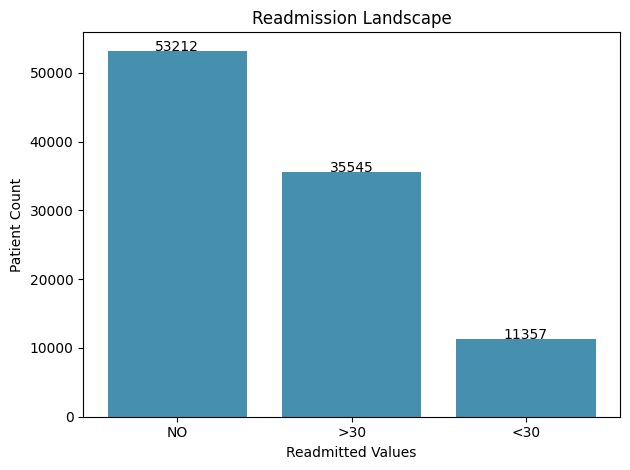
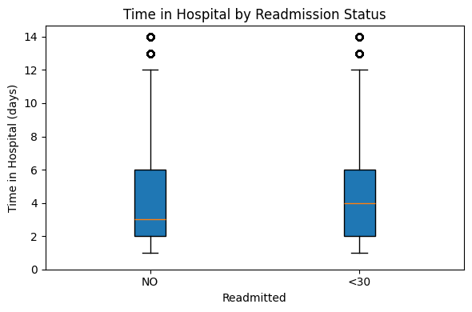
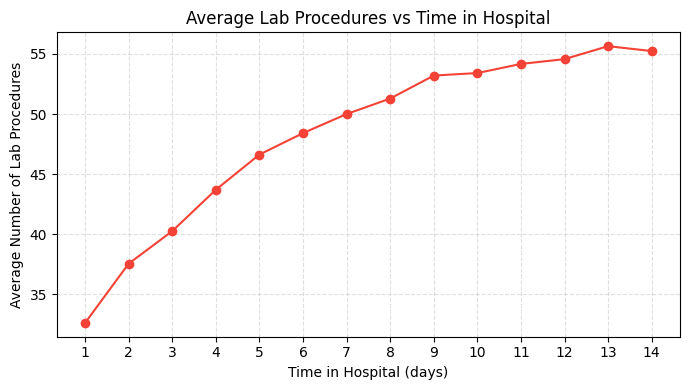
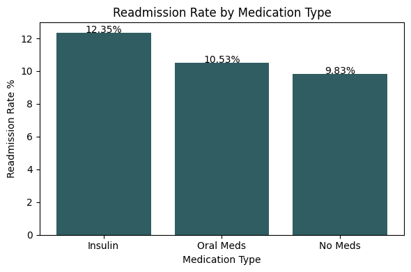
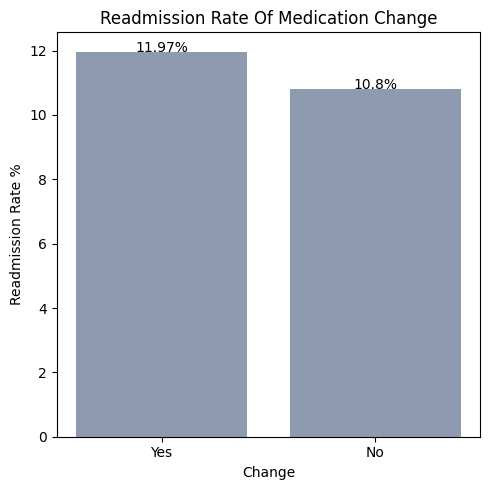
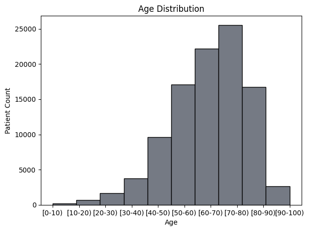
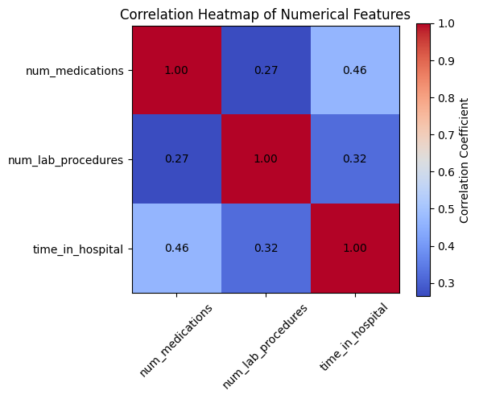
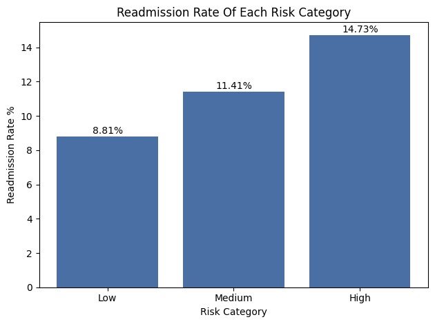

# Strategic Patient Risk Stratification & Readmission Predictive Modeling

Vitality Health Network (VHN) faces a critical operational and financial challenge: the 30-day readmission rate for diabetic patients has reached 18%, exceeding acceptable benchmarks and triggering financial penalties under the CMS Hospital Readmissions Reduction Program (HRRP). 

This project delivers a comprehensive predictive analysis model designed specifically for VHN to investigate and mitigate this issue. The goal goes beyond merely reporting compliance statistics; the analysis was engineered to comprehensively identify the root clinical and operational factors driving these preventable returning visits. By meticulously evaluating over 100,000 patient records from the "Diabetes 130-US Hospitals" dataset, this project reveals the hidden drivers of hospital readmissions. 

Furthermore, to ensure these analytical insights translate into seamless operational action, we developed the **Vitality Complexity Index (VCI)**. The VCI serves as a unified, easy-to-track predictive score that anticipates the readmission risk of individual patients based on an aggregation of their clinical data. Grounded in these findings, we provide targeted, strategic recommendations that allow VHN to allocate resources efficiently, improve patient continuity of care, and significantly reduce readmission rates.

---

## Technologies & Tools

- **Programming Language:** Python
- **Data Manipulation & Analysis:** NumPy, Pandas
- **Data Visualization:** Matplotlib, Seaborn
- **Web Scraping & Data Extraction:** `requests`, BeautifulSoup

---

## Analytical Methodology

Developing this predictive model required transitioning raw, disparate clinical logs into a polished, executive-grade analytical asset. This was achieved through a rigorous five-step methodological framework:

### 1. Data Sanitation & Stabilization
To extract meaningful insights, the "dirty" clinical dataset required extensive stabilization. This phase focused on standardizing non-standard null values (often recorded ambiguously as `?`) and correctly re-casting data types (such as converting objects to categorical datatypes) to optimize processing efficiency. In addition, we explicitly filtered out invalid records, such as encounters involving deceased patients, to ensure statistical validity and prevent mortality data from introducing noise into the readmission calculations.

### 2. Web Scraping & Data Enrichment
Raw clinical datasets often rely on cryptic coding standards that obscure operational meaning. To resolve this, we utilized the `requests` and `BeautifulSoup` libraries to dynamically scrape an external, public ICD-9 coding repository (`icd9data.com`). We retrieved the official, human-readable disease descriptions and successfully merged this newly extracted data with our primary internal dataset. This provided immediate clinical interpretability for the top 20 most frequent patient diagnoses.

### 3. Feature Engineering: The Vitality Complexity Index (VCI)
Identifying high-risk patients required synthesizing multiple disconnected metrics into a single source of truth. By adapting established medical literature—specifically the validated LACE index framework—we wrote complex Python functions with conditional logic to create the **Vitality Complexity Index (VCI)**. This custom risk-scoring algorithm aggregates multiple patient dimensions into a single actionable metric that enables rapid clinical triage.

### 4. Exploratory Data Analysis (EDA)
To establish the evidence base for our recommendations, we conducted in-depth Exploratory Data Analysis. Utilizing `Seaborn` and `Matplotlib`, we generated robust visualizations to uncover underlying distributions, compound correlations, and behavioral trends within the data. This visual exploration directly surfaced the primary operational and demographic drivers behind the 18% readmission rate.

### 5. Strategic Reporting
The culmination of the project involved synthesizing the technical methodologies and statistical findings into a professional business framework. Instead of simply delivering a data dump, the technical analysis was carefully translated into actionable, data-driven recommendations tailored specifically for the VHN executive board and clinical leadership.

---

## Key Clinical & Operational Insights

Our analysis investigated the interactions between demographic characteristics, treatment protocols, and operational workflows to uncover the root causes of patient readmissions.

### Overall Readmission Landscape
The initial analysis identified the overall frequency of readmission outcomes across the diabetic patient population, establishing the baseline scope of the challenge.

### The Investigation-Stay Paradox
Contrary to intuition, extended hospitalizations and a high volume of diagnostic lab tests directly correlate with significantly higher readmission probabilities. This trend indicates that prolonged diagnostic investigation acts as a proxy for underlying patient instability and comorbidity, rather than serving as a protective cushion of "thoroughness."

### Medication Adjustments and Insulin Dependency
Treatment stability is a critical factor in post-discharge success. Patients who experienced changes to their medication type or dosage during their inpatient stay faced notably higher readmission rates compared to those maintaining stable regimens. Furthermore, patients strictly requiring insulin therapy exhibited an elevated vulnerability, emphasizing the risks associated with advanced disease progression.

### Discharge Disposition Vulnerability
The specific operational location to which a patient is discharged heavily influences their likelihood of readmission. The data decisively shows that patients transitioned to Skilled Nursing Facilities (SNFs) return to the hospital at a much higher and more alarming rate compared to standard home-based discharges, pinpointing a major gap in the continuity of care.

### Demographic Vulnerabilities
Age serves as a dominating predictor of readmission risk. The likelihood of a 30-day return begins to scale significantly for patients aged 60 and above, ultimately peaking within the 70–80 demographic bracket. Additional variations and risk clusters were also observed when intersecting race and gender metrics.

### Compounding Feature Correlation
To understand how these individual metrics influence one another, a correlation heatmap of numerical features was rendered. This visualization modeled the compounding interactions between clinical resource intensity and operational decisions, confirming that patient complexity operates via heavily interlinked variables.

---

## The Vitality Complexity Index (VCI)

To track high-risk populations seamlessly, the VCI was developed to quantify patient complexity and explicitly forecast the probability of an early hospital return. By aggregating scattered data points, clinicians are empowered with a single, highly interpretive score derived from four crucial variables:

- **Length of Stay Score:** Longer inpatient durations inherently map to increased physiological acuity and treatment difficulty.
- **Acuity of Admission Score:** Emergency and trauma admissions are assigned mathematically higher risk weights due to the lack of pre-planned care.
- **Comorbidity Burden Score:** Evaluated strictly through the sheer volume of uniquely recorded clinical diagnoses.
- **Emergency Visit Intensity Score:** Accounts for historical instability by calculating frequent Emergency Department utilization over the year prior to the patient's current admission.

### Risk Stratification Results
Applying the VCI score logic over the dataset isolates the most vulnerable patients with high precision. The categorical evaluation confirms the algorithm's predictive validity:

- **Low Risk (VCI < 7):** Represents the most stable diabetic cohort with the lowest baseline readmission probability.
- **Medium Risk (VCI 7–10):** Represents a moderate but meaningful increase in structural risk, requiring improved transitional observation.
- **High Risk (VCI > 10):** Isolates the most exceptionally vulnerable patients exhibiting the absolute highest statistical likelihood of returning to the hospital within 30 days.

---

## Strategic Interventions & Recommendations

Bridging the gap between raw data science and executive action, we recommend the following strategic interventions derived directly from the model's insights to actively mitigate readmission penalties.

1. **EHR Integration for Early Risk Alerts:** Embed the calculated VCI metric directly into the Electronic Health Record (EHR) system. This integration will proactively flag High-Risk patients within the critical 24-hour admission window, allowing care teams to prioritize intervention rather than simply reacting at the moment of discharge.
2. **Enhanced Discharge Protocols for SNF and Emergency Pathways:** Given the data surrounding discharge dispositions and admission acuity, VHN must mandate thorough, rigid discharge instructions, strict pre-exit medication reconciliation, and mandatory 48–72 hour follow-up appointments specifically for patients scoring Medium- or High-Risk, or those initially admitted through emergency trauma pathways.
3. **Targeted Medication Monitoring:** Deploy pharmacist-led follow-up calls or directed telehealth check-ins within the first 7 days post-discharge specifically targeting patients prescribed insulin or those whose primary medications were structurally adjusted during their stay.

---

## Dataset Attributes (Core Variables)
- `encounter_id`: Unique admission identifier.
- `patient_nbr`: Unique patient identifier.
- `race` & `gender`: Demographics mapping.
- `admission_type_id`: Identifier for admission source (Emergency, Elective).
- `time_in_hospital`: Count of days between admission and discharge.
- `num_lab_procedures` & `num_medications`: Clinical intensity tracking.
- `number_emergency`: Number of ED visits in the prior year.
- `readmitted`: Target variable (`NO`, `>30`, `<30` days).

